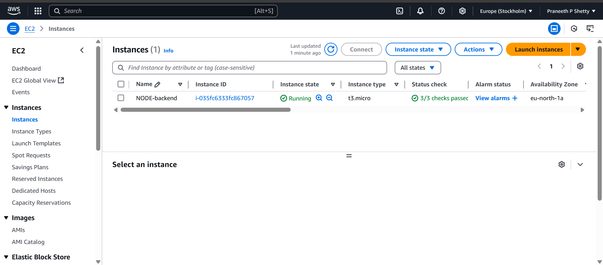

# Node.js and Next.js Application

This is a simple application built with **Next.js** (for the frontend) and **Node.js** (for the backend). The backend is hosted on **AWS EC2** and uses **MongoDB** for the database. The app provides basic APIs for user registration and fetching all users.

## Project Structure
## AWS ECS Dashboard

- **Frontend**: Built with **Next.js**, hosted locally or deployed to a service of your choice.
- **Backend**: Built with **Node.js** and **Express**, hosted on **AWS EC2**, and uses **MongoDB** as the database.

### Backend APIs

- **User Registration**: 
  - `POST http://13.60.75.97:3000/api/register`
  - Endpoint to register a new user.
  
- **Get All Users**:
  - `GET http://13.60.75.97:3000/api/users`
  - Endpoint to fetch all registered users.

## Tech Stack

- **Node.js** for the backend
- **Next.js** for the frontend
- **MongoDB** for the database
- **AWS EC2** for hosting the backend

## Backend code
   https://github.com/Praneethpshetty24/node-js.git

